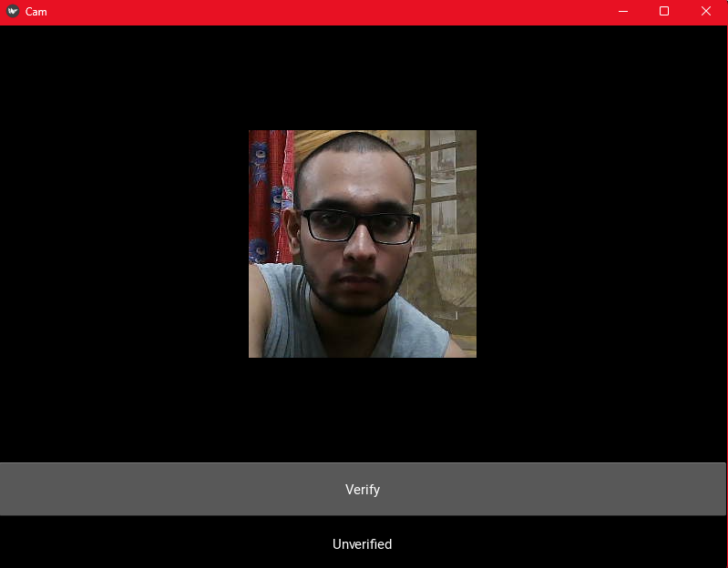

# Face Verification App

A face verification system that utilizes a Siamese Neural Network architecture to determine whether two face images belong to the same person. Built with TensorFlow, OpenCV, and Kivy, this project supports real-time facial authentication through a webcam interface

---

## 📋 Features

- 🧠 **Siamese Neural Network Architecture:** Learns a similarity function to compare pairs of face embeddings using a custom L1 distance layer.
- 🧪 **Real-Time Face Verification:** Cross-platform graphical user interface for live camera feed integration to capture and compare faces for instant verification.
- 📊 **Training with Positive/Negative Image Pairs:** Uses both anchor-positive and anchor-negative samples, leveraging a supervised contrastive setup.
- 🎨 **Data Augmentation Pipeline:** Random brightness, contrast, flipping, and JPEG quality adjustments ensure robustness of the model.

---

## Tech Stack

- **Python 3.x** – Core application logic
- **TensorFlow** – Framework for model architecture and training
- **OpenCV** – Webcam input and image handling
- **Kivy** – GUI framework for rendering cross-platform desktop applications
- **NumPy / Matplotlib** – Data processing and visualization tools

---

## Project Structure

```
├── siamese_recognizer.ipynb          # Model training: data collection, preprocessing, training pipeline
├── cs_objects.py                  # Custom TensorFlow layer for L1 distance calculation
├── face_ver.py                    # Kivy GUI: webcam integration and real-time face verification
├── application_data/
│   ├── input_image/               # Stores the webcam snapshot to verify
│   └── verification_images/      # Pre-registered images to match against
├── data/
│   ├── anchor/
│   ├── positive/
│   └── negative/
├── Checkpoints/                   # Model checkpoints saved during training
├── Siamese-Recognizer.h5          # Final saved model used for inference
├── lfw/                           # Labeled Faces in the Wild dataset (used for negatives)

```

---

## 🧠 System Design & Model Architecture

This project leverages a Siamese Neural Network trained to differentiate between matching and non-matching pairs of faces. It follows a triplet-based verification paradigm with anchor, positive, and negative samples.

### 🔍 Architecture

- Embedding Block
    - Stack of convolutional layers (64 → 128 → 256)
    - MaxPooling2D for downsampling
    - Final Dense layer to flatten and produce a 4096-dimensional embedding

- Distance Layer
    - Custom L1 Distance Layer (absolute difference between embeddings)

- Output
    - Dense layer with sigmoid activation to predict similarity

### 📶 Verification Logic

- Captures an anchor image via webcam and compares it against a folder of registered images

- Calculates average similarity score, if the threshold is crossed → face is verified

---

## 📸 Visual Demo

### 📷 Real-Time Verification Window

<p align="center">
 
</p>

---

## 📆 Getting Started

### 📁 Prerequisites

- **Python 3.x**  
- **Tensorflow**
- **Kivy**
- **numpy**
- **matplotlib**
- **opencv-python**

---

###  🚀 Clone and Run

1. **Clone the repository**
```
    $ git clone https://github.com/nogi2k2/Whispr.git
```

2. **Navigate into the project directory**
```
    $ cd <directory>
```

3. **Launch the GUI**  (model .h5 provided in repo)
```
    python face_ver.py
```
---
